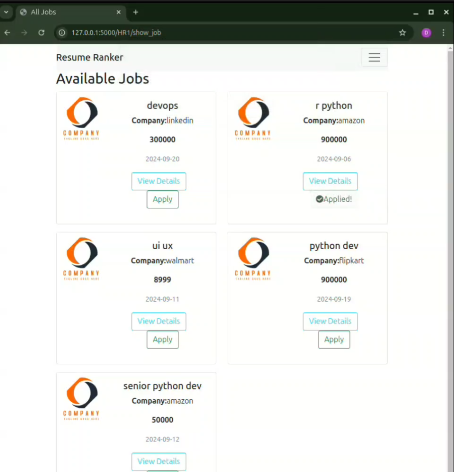
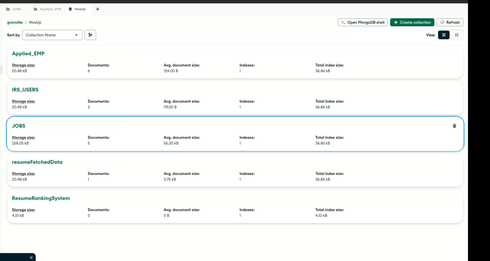

# HireUp

HireUp is a Resume Ranking System designed to streamline the recruitment process by leveraging advanced algorithms to rank resumes based on their content and relevance to job descriptions. This application is built to assist HR professionals and recruiters in quickly identifying suitable candidates from a pool of applicants.

## Working Videos
## Working Videos

### Demo Video 1

### Demo Video 2

## Tech Stack

- **Backend**:
  - Python
  - Flask
  - MongoDB
  - JWT for authentication

- **Frontend**:
  - HTML
  - CSS
  - JavaScript
  - Bootstrap for responsive design

- **Additional Libraries**:
  - [spaCy](https://spacy.io/) for Natural Language Processing (NLP)
  - [Flask-CORS](https://flask-cors.readthedocs.io/en/latest/) for handling CORS
  - [python-dotenv](https://pypi.org/project/python-dotenv/) for managing environment variables

## ATS Capabilities

HireUp is designed with ATS (Applicant Tracking System) capabilities, ensuring that:

- **Keyword Optimization**:
  - Resumes are parsed and ranked based on relevant keywords from job descriptions, allowing for better matching of candidates.

- **Structured Data**:
  - The application extracts structured data from resumes, making it easier for recruiters to compare candidates.

- **Customizable Ranking Criteria**:
  - Recruiters can customize the ranking criteria to align with their specific needs and preferences.
## Features

- **User Authentication**:
  - Secure login and registration system using JWT for authentication.
  
- **Resume Upload**:
  - Users can upload their resumes in various formats (PDF, DOCX).
  
- **Resume Ranking**:
  - The application analyzes and ranks resumes based on their content and relevance to job descriptions using NLP techniques.
  
- **Admin Panel**:
  - Admin users can manage user accounts and view rankings.
  
- **Job Posting**:
  - HR professionals can post job openings and view applicants' resumes.
  
- **Search Functionality**:
  - Users can search and filter resumes based on various criteria.

- **Responsive Design**:
  - The application is fully responsive and accessible on mobile devices.

## Installation

1. pip install -r requirements.txt
2. Replace GOOGLE_CLIENT_ID
3. add client_secret.json 
4. Replace MONGO_URI
5. Add assets folder
6. Finally flask run to start the server

